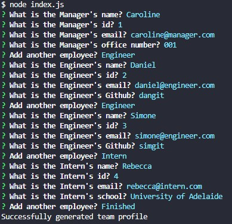
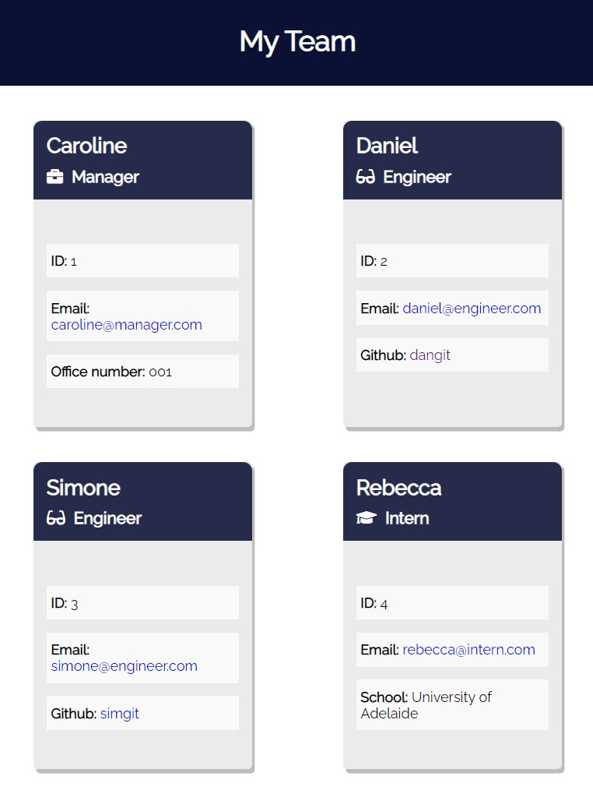
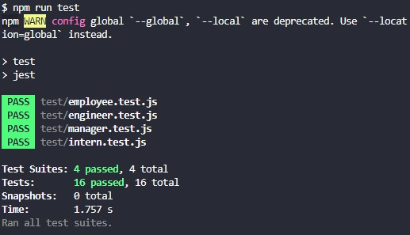

# Team Profile Generator
## Description
Node.js command-line application that takes in information about employees on a software engineering team and generates an HTML webpage that displays summaries for each person
## Table of Contents
1. [User Story](#user-story)
1. [Acceptance Criteria](#acceptance-criteria)
1. [Installation](#installation)
1. [Usage](#usage)
1. [Testing](#testing)
1. [Screenshots](#screenshots)
1. [Links](#links)
## User Story
```
AS A manager
I WANT to generate a webpage that displays my team's basic info
SO THAT I have quick access to their emails and GitHub profiles
```
## Acceptance Criteria
```
GIVEN a command-line application that accepts user input
WHEN I am prompted for my team members and their information
THEN an HTML file is generated that displays a nicely formatted team roster based on user input
WHEN I click on an email address in the HTML
THEN my default email program opens and populates the TO field of the email with the address
WHEN I click on the GitHub username
THEN that GitHub profile opens in a new tab
WHEN I start the application
THEN I am prompted to enter the team manager’s name, employee ID, email address, and office number
WHEN I enter the team manager’s name, employee ID, email address, and office number
THEN I am presented with a menu with the option to add an engineer or an intern or to finish building my team
WHEN I select the engineer option
THEN I am prompted to enter the engineer’s name, ID, email, and GitHub username, and I am taken back to the menu
WHEN I select the intern option
THEN I am prompted to enter the intern’s name, ID, email, and school, and I am taken back to the menu
WHEN I decide to finish building my team
THEN I exit the application, and the HTML is generated
```
## Installation
To run this application, you must run command 'npm i' to install dependencies.
## Usage
In the command line, start by running 'node index.js' and follow the prompts to create your team. Once you are finished constructing your team, select 'Finished', and an index.html file will be generated within the 'public' folder. You can view your team in your default browser.

See [screenshots](#screenshots) to view example.
## Testing
In order to run the tests, run 'npm run test'.

See [screenshots](#screenshots) to view example.
## Screenshots
  

  


## Links
GitHub: [https://github.com/carolinemae](https://github.com/carolinemae/team-profile-generator)

Video (application): [https://drive.google.com/file/d/18z6q2ihXEqgetW31uoW-Qh3Ed5Z1yvQ8/view](https://drive.google.com/file/d/18z6q2ihXEqgetW31uoW-Qh3Ed5Z1yvQ8/view)

Video (tests): [https://drive.google.com/file/d/18z6q2ihXEqgetW31uoW-Qh3Ed5Z1yvQ8/view](https://drive.google.com/file/d/18z6q2ihXEqgetW31uoW-Qh3Ed5Z1yvQ8/view)

Email: [carolinemaee@live.com](mailto:carolinemaee@live.com)

[Back to the top](#team-profile-generator)